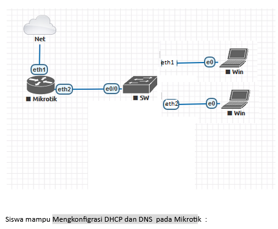
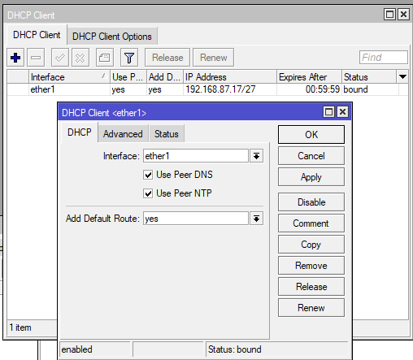
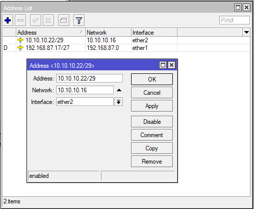
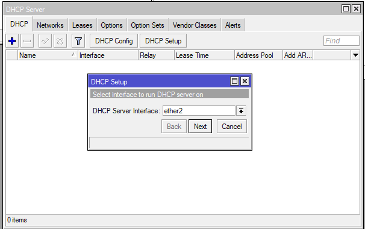
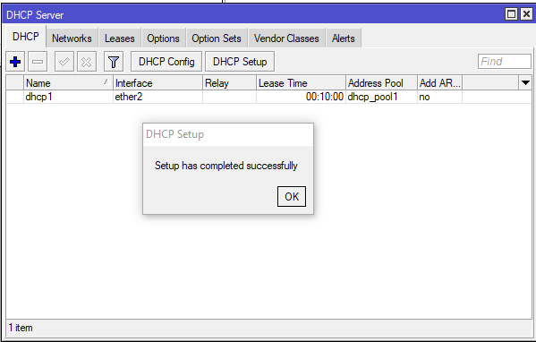
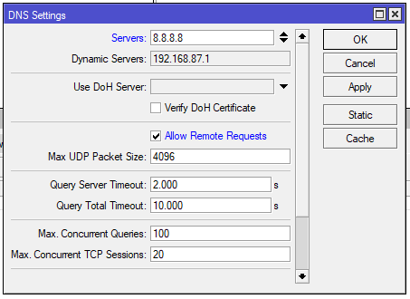
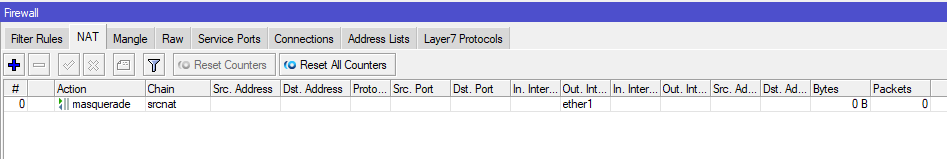
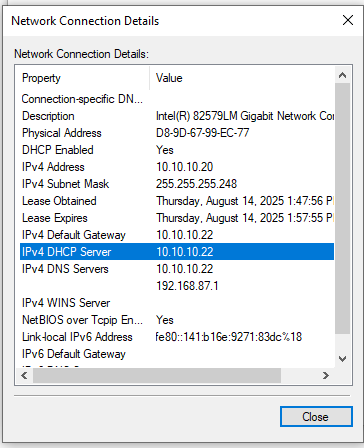
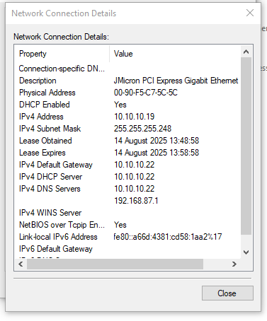

# LAB-15-DHCP-DNS-INTERNET
Kamis 14 Agustus 2025  
  
# Mengkonfigrasi DHCP dan DNS  pada Mikrotik  
    

  1. Setting DHCP Client agar Mikrotik terhubung ke intrnet melalui ether1 yang terhubung ke ISP.  
  
  2. Buat IP static untuk ether2  
  
  3. Setup DHCP Server untuk membagikan IP ke client secara otomatis.  
  
  4. Setting DNS, masukan DNS google.  
  
  5. Tambahkan Firewall NAT agar client bisa mengakses ke internet.  
  
  6. Pindah ke PC Client dan jangan lupa untuk setting IP nya jadi obtain auto.  
  
  7. Cek apakah mendapat IP, di PC client.  
     PC1:  
       
     PC2:  
       

# Kesimpulan
  Dengan DHCP Server, pembagian alamat IP, gateway, dan DNS ke perangkat klien dilakukan secara otomatis, sehingga meminimalkan kesalahan konfigurasi manual dan menghemat waktu.
